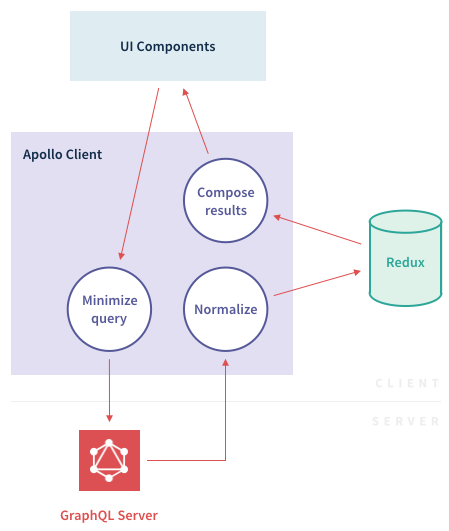
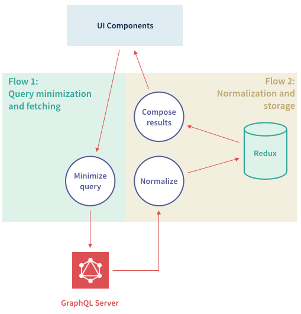

For now, we just have a few diagrams, with the goal of adding descriptive text with links to the actual source code.

The current diagrams are aspirational - the code doesn't always reflect this structure exactly, but it should after a bit more work.

<h2 id="overview">Overview</h2>

Here's a high level overview of the data flow in Apollo Client:

The client is split into two main flows, which we will explain in more detail below:

<h2 id="minimize">Minimization</h2>

In this flow, queries arrive from UI components and are processed before being sent to the server.

<h2 id="normalize">Normalization</h2>

In this flow, query results arrive from the server, and are saved to the store in normalized form. The query shape is then reconstructed before passing the results to any UI components affected by the new state.

