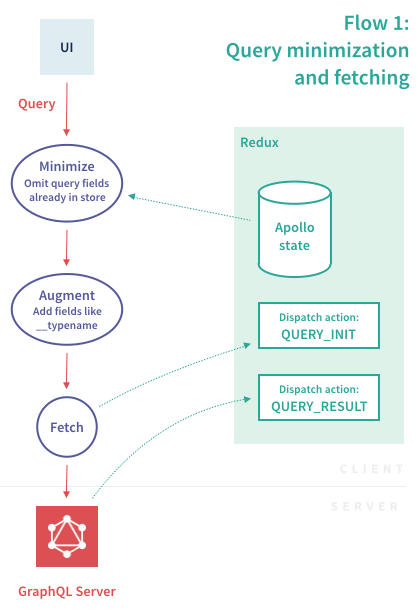
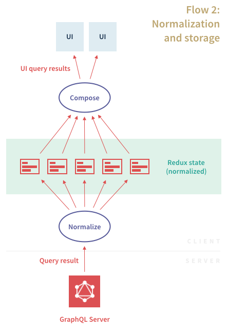

<h2 id="overview">Overview</h2>

Here's a high level overview of the data flow in Apollo Client:


The client is split into two main flows, which we will explain in more detail below:


<h2 id="minimize">Minimization</h2>

In this flow, queries arrive from UI components and are processed before being sent to the server.



<h2 id="normalize">Normalization</h2>

In this flow, query results arrive from the server, and are saved to the store in normalized form. The query shape is then reconstructed before passing the results to any UI components affected by the new state.



It's easiest to see what happens with an example. Let's say we send the following query to the server:

```
{
  allPeople {
    id
    name
  }
}
```

The result for that query might look like this:

```js
{
  allPeople: [
    {
      id: '1',
      name: 'Luke Skywalker',
    },
    {
      id: '4',
      name: 'Darth Vader'
    }
  ]
}
```

One option might be to just throw that blob of JSON directly into the store, and be done with it. But it turns out that the best option is to _normalize_ the data (see [Benefits](#query-benefits)). This means splitting the tree into individual objects and references between them, and storing those objects in a flattened data structure.

This process requires generating a unique identifier for each object, because we need to be able to refer to the objects somehow to put them back together again. 

By default, `ApolloClient` will attempt to use the commonly found primary keys of `id` and `_id` for the unique identifier if they exist on an object.  

If `id` and `_id` are not specified, `ApolloClient` will, by default, fall back to the path to the object in the query, such as `ROOT_QUERY.allPeople.0` for the first record returned on the `allPeople` root query.

This "getter" behavior for unique identifiers can be configured manually via the `dataIdFromObject` option passed to the `ApolloClient` constructor, so you can pick which field is used if some of your data follows unorthodox primary key conventions.

For example, if you wanted to key off of the `key` field for all of your data, you could configure `dataIdFromObject` like so:

```js
var client = new ApolloClient({
  dataFromObjectId: object => object.key
});
```

This also allows you to use different unique identifiers for different data types by keying off of the `__typename` property attached to every object typed by GraphQL.  For example:

```js
var client = new ApolloClient({
  dataFromObjectId: object => {
    switch (object.__typename) {
      case 'foo': return object.key; // use `key` as the primary key
      case 'bar': return object.blah; // use `blah` as the priamry key
      default: return object.id || object._id; // fall back to `id` and `_id` for all other types
    }
  }
});
```

<h3 id='query-benefits'>Benefits</h3>

One of the main things that normalization does for us is decouple the identity of an object from the query that was used to fetch it. This means that any time the object with ID `'1'` is changed in the store, any query that involved that object can be updated. This has important implications for UI consistency - you don't want to end up in a situation where two parts of your UI that are displaying the same object, but have different content.

Another great thing about normalization is that it enables smarter data refetching and even basic reactivity. For example, you can do a really large query for all of your app's data, then run a smaller query to refetch just some of the objects. Since the large query is watching the objects in the store, its result will be updated automatically when the smaller query returns. In a similar way, you could listen to a reactive data source like a subscription or a websocket, and push the results into the store, which would also update any interested queries.

Lastly, normalization supports Apollo's Optimistic UI features. Optimistic UI functions either by returning fake client results for mutations, or by reaching in and modifying store objects directly, but either way it's important that those updates affect all queries on the page and not just the single UI component that initiated the mutation.
